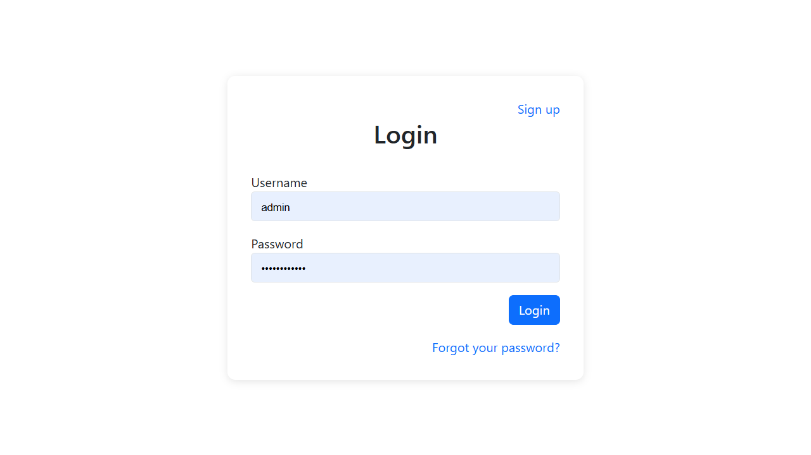
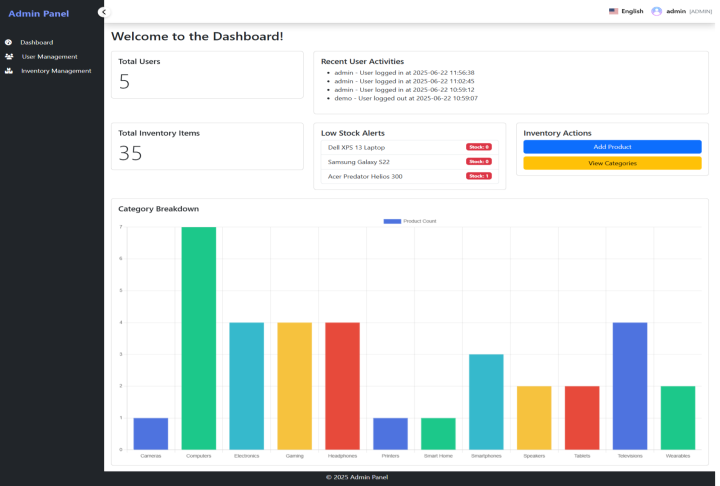
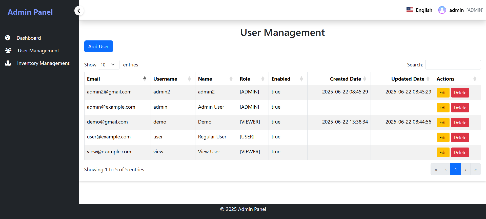
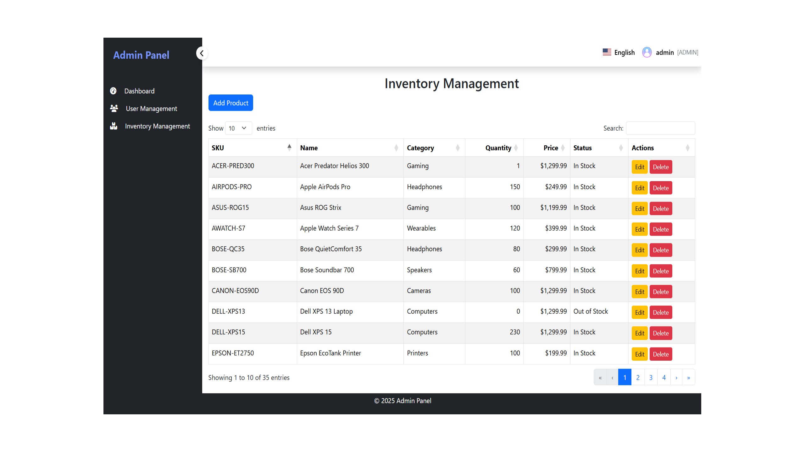

# Spring Boot Admin Panel – Java Inventory System with RBAC (Full Source Code)

🚀 A developer-ready Spring Boot Admin Panel with:

- ✅ Inventory Management Module
- ✅ Role-Based Access (RBAC)
- ✅ User Logs Dashboard
- ✅ Full Source Code Included (with README)

---

## 🔧 Built With

- Spring Boot 3
- Hibernate & JPA
- Thymeleaf + Bootstrap
- MySQL 5.7+
- Java 17+

---

## 📦 Full Version Includes

- 🔐 Role-Based Access with UI
- 📊 Inventory Management Dashboard
- 🧾 User Logs Tracker
- 🧰 DB Setup Scripts + Docs
- 💡 Clean, ready-to-use backend template

---

## 🎯 Who Is This For?

- Freelancers, Java developers, startup teams
- Anyone needing a production-ready Spring Boot starter kit

---

## 🛒 Get Full Source Code

🔥 [Buy on Gumroad – Only $29 for the First 20 Buyers](https://linaar.gumroad.com/l/adminpanel)

---

### 🔍 Project Structure (Preview Only)

```plaintext
📦 Customizable-Admin-Panel
├── src/
│   ├── main/
│   │   ├── java/com/adminpanel/
│   │   ├── resources/
│   └── test/
├── pom.xml
├── database/
│   └── admin_panel_schema.sql
├── README.md
```

---

## 🖼️ Screenshots

### Login Page


### Dashboard


### User Management  


### Inventory Management  


---

## ⚙️ Setup Guide (Full Version)

1. Install Java 17, Maven, and MySQL
2. Import into IntelliJ or any IDE
3. Setup the DB with the scripts in the ZIP.
4. Run: `mvn spring-boot:run`
5. Access at: `http://localhost:8080`

📖 Full guide inside the product ZIP

---

## 📺 Watch the 2-Minute Walkthrough  
▶️ [YouTube Demo](https://www.youtube.com/watch?v=q2F8-HT7l74)

---

## 🔗 More Info

📰 [Dev.to Blog](https://dev.to/ithustle/spring-boot-admin-panel-with-inventory-rbac-full-source-code-2ign)

---

> 🧠 Want to build faster? Use this as your backend base.
---

## 📈 SEO Keywords (for Discovery)

spring boot admin panel, springboot starter kit, java inventory system, CRUD backend, RBAC login java,
spring boot dashboard, admin panel source code, spring boot crud
